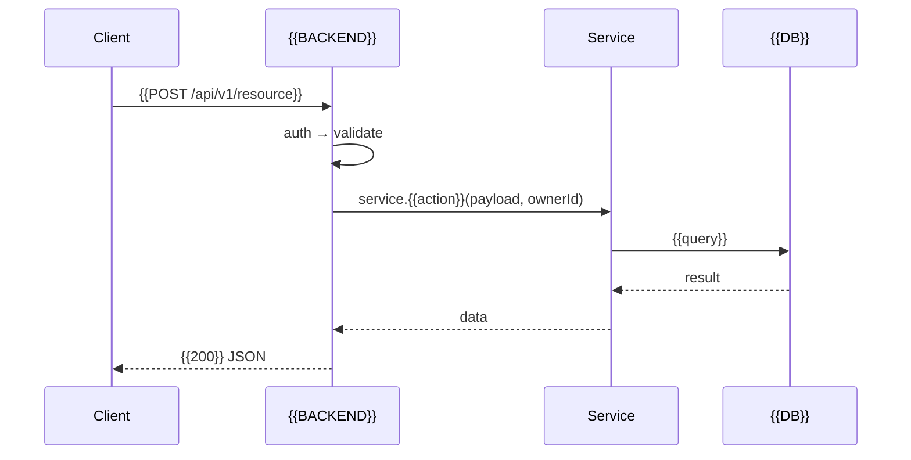
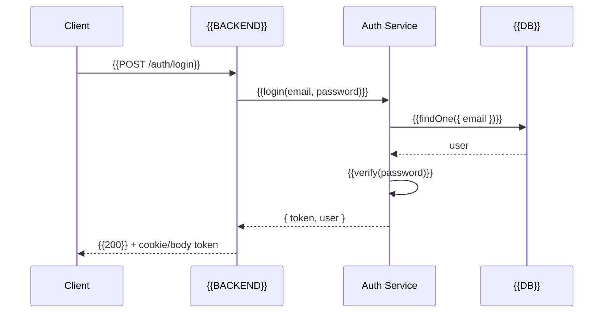

# Architecture Document — {{PROJECT_NAME}}
**Project:** {{PROJECT_NAME}} · **Version:** {{X.Y}} · **Status:** {{Draft}} · **Updated:** {{DATE}}

---

## 1. System Architecture (Logical View)

> **Fill:** High-level tiers. Redraw with your actual components. *(example)*

```
┌─────────────────────────────────────────────┐
│                 CLIENT TIER                 │
│        {{FRONTEND_FRAMEWORK}} SPA           │
│  {{Page_1}} · {{Page_2}} · {{Page_3}}      │
└───────────────────┬─────────────────────────┘
                    │ HTTP / {{AUTH_HEADER}}
┌───────────────────┴─────────────────────────┐
│                 API TIER                    │
│      {{BACKEND_FRAMEWORK}} · {{LOGGER}}     │
│  Middleware: Rate → Auth → Validate → Error │
│  Route → Controller → Service → Model       │
│  {{SCHEDULER}} (background job, if any)     │
└───────────────────┬─────────────────────────┘
                    │
┌───────────────────┴─────────────────────────┐
│                 DATA TIER                   │
│              {{DB_ENGINE}}                  │
└─────────────────────────────────────────────┘
```

---

## 2. Container Diagram

> **Fill:** *(example)*

```mermaid
graph TB
    U[Browser / Client] -->|HTTPS| FRONTEND[{{FRONTEND}}]
    FRONTEND -->|API| API[{{BACKEND}}]
    API --> DB[({{DB}})]
    API --> SMTP[{{EMAIL_PROVIDER}}]
    JOB[{{SCHEDULER}}] -.->|periodic| DB
```

---

## 3. Design Methodology

### 3.1 API Style
> **Fill:** REST / GraphQL / RPC. Resource naming, HTTP verb conventions, status
> code usage, versioning (`/api/v1/...`).

### 3.2 Layered Architecture (Backend)
> **Fill:** Adjust layer names to your framework. *(example — keep the idea)*

```
Request → [Route] → [Middleware] → [Controller] → [Service] → [Model] → {{DB}}
```

| Layer | Responsibility | Dependencies |
|---|---|---|
| Route | URL mapping, HTTP method, param extraction | Router |
| Middleware | Auth, rate-limit, validation, logging, errors | — |
| Controller | Parse request, call service, format response (thin) | — |
| Service | Business logic, orchestration, domain rules | Models, other services |
| Model | Schema, indexes, virtuals | {{ODM/ORM}} |

### 3.3 Frontend Paradigm
> **Fill:** Component model, server-state vs UI-state split, routing.

### 3.4 Pragmatic MVP Approach
> **Fill:** Duplication tolerance, monorepo policy, one-command local dev.

---

## 4. Design Patterns

### 4.1 Middleware Chain
> **Fill:** Registration order matters. *(example)*
> ```javascript
> app.use(requestLogger); app.use(securityHeaders); app.use(cors);
> app.use(bodyParser); app.use(rateLimit('/auth'));
> app.use('/api/v1/auth', authRoutes); app.use('/api/v1', authMiddleware);
> app.use('/api/v1/{{resource}}', resourceRoutes);
> app.use(notFoundHandler); app.use(errorHandler);
> ```

### 4.2 Validation Boundary
> **Fill:** Where input is validated and by what (e.g. {{VALIDATION_LIB}} at the
> controller boundary, shared with the client).

### 4.3 Error Handling Pattern
> **Fill:** Central error classes + error middleware. *(example)*
> ```javascript
> class AppError extends Error { constructor(message, statusCode) }
> class NotFoundError extends AppError { /* 404 */ }
> function errorHandler(err, req, res, next) {
>   const status = err.statusCode || 500
>   res.status(status).json({ error: { message: err.message, code: err.code || 'INTERNAL_ERROR' } })
> }
> ```

### 4.4 Idempotent Background Job
> **Fill:** How repeated job runs avoid duplicate side effects (a ledger/table,
> idempotency keys, etc.).

---

## 5. Data Flow (Request/Response Lifecycle)

> **Fill:** *(example)*



---

## 6. Entity-Relationship Diagram

> **Fill:** Full ERD lives in `SCHEMA.md`. Optionally re-render a condensed copy
> here or just link: see `SCHEMA.md §2`.

---

## 7. Deployment Topology

### 7.1 Development (Local)
> **Fill:** Docker compose or equivalent. *(example)*
> ```yaml
> services:
>   api:   { build: ./server, ports: ["3000:3000"] }
>   web:   { build: ./client, ports: ["5173:5173"] }
>   db:    { image: {{DB_IMAGE}}, ports: ["{{DB_PORT}}:{{DB_PORT}}"] }
> ```

### 7.2 Production
> **Fill:** Hosting per component, DNS, TLS, env vars. *(example)*

| Component | Host | Notes |
|---|---|---|
| {{FRONTEND}} | {{HOST_1}} | {{notes}} |
| {{BACKEND}} | {{HOST_2}} | {{notes}} |
| {{DB}} | {{HOST_3}} | {{notes}} |

**Environment variables (production):**
```
NODE_ENV=production
{{SECRET_VARS_...}}
```

---

## 8. Sequence Diagrams

> **Fill:** One per critical flow. *(example — login)*

### 8.1 {{LOGIN_OR_AUTH}} Flow


### 8.2 {{CORE_ENTITY}} Lifecycle
> **Fill:** create → update → (optional) automated follow-up.

---

## 9. Key Implementations

### 9.1 Authentication
> **Fill:** Session vs JWT, cookie vs header, token lifetime, refresh strategy.

### 9.2 Derived State (computed, not stored)
> **Fill:** *(example)* status computed at read time from `dueDate` + prefs,
> never persisted.

### 9.3 Scheduled Job
> **Fill:** Scheduler, cadence, idempotency ledger, failure handling.

---

## 10. Security Boundaries

| Layer | Control | Implementation |
|---|---|---|
| Transport | HTTPS only | {{hosting + HSTS}} |
| Credentials | Hashed + secret-stored | {{bcrypt/argon2 cost ≥ N}} |
| CORS | Origin allowlist | {{config}} |
| Rate limiting | Sensitive endpoints | {{limits}} |
| Data scoping | {{OWNER_FIELD}} filter | {{pattern}} |
| Secrets | Environment variables | never committed |
| Validation | {{VALIDATION_LIB}} | all input validated at boundary |
| Headers | Security headers | {{helmet or equivalent}} |
| Deletion | Compliance purge | {{GDPR/retention policy}} |

---

## 11. Error Handling & Observability

### 11.1 Central Error Handler
> **Fill:** as in §4.3.

### 11.2 Structured Logging
> **Fill:** Logger, request-id, log levels, redaction of PII/secrets.

### 11.3 Observability Summary

| Tool | Purpose | Where |
|---|---|---|
| {{LOGGER}} | Structured logs | backend + jobs |
| {{ERROR_TRACKER}} | Error tracking | frontend + backend |
| {{UPTIME_CHECK}} | Liveness | HTTP GET {{/health}} |

### 11.4 Health Endpoint
> **Fill:** Status, DB connectivity, uptime.

---

## 12. Cross-Cutting Concerns (Middleware Ordering)

> **Fill:** Document the exact registration order and *why* each step must precede
> the next (logging first, security headers early, CORS before routes, body parsers
> before handlers, auth gate before protected routes, error handler last).

---

## 13. Project Directory Structure

> **Fill:** Annotated tree. *(example)*
> ```
> {{PROJECT}}/
> ├── client/            # {{FRONTEND}} app
> │   └── src/           # components, pages, hooks, lib
> ├── server/            # {{BACKEND}} API
> │   └── src/           # routes, controllers, services, models, middleware
> ├── docker-compose.yml
> └── context/           # this folder
> ```

---

## 14. Technology Choices & Rationale

| Choice | Rationale |
|---|---|
| {{TECH_1}} over {{ALT_1}} | {{why}} |
| {{TECH_2}} over {{ALT_2}} | {{why}} |

> **Fill:** For every non-obvious choice, one line on the tradeoff. *(example)*
> "{{Validation lib}} over {{alt}} — lighter, composable, shared with frontend forms."

---

## 15. Scalability Notes (later phases)

> **Fill:** What changes at scale. *(example)*
>
> 1. Extract background jobs into a dedicated worker ({{queue}} + {{broker}}).
> 2. Add read replicas / caching for hot queries.
> 3. Horizontal scaling behind a load balancer.
