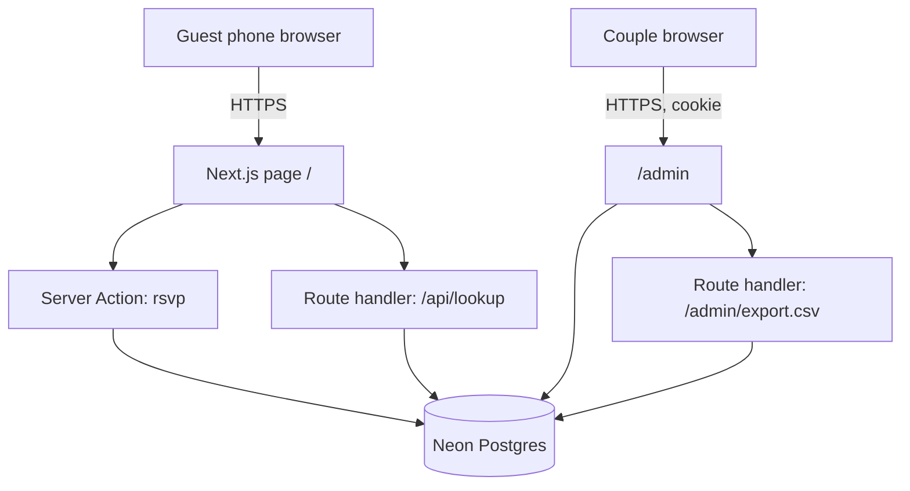
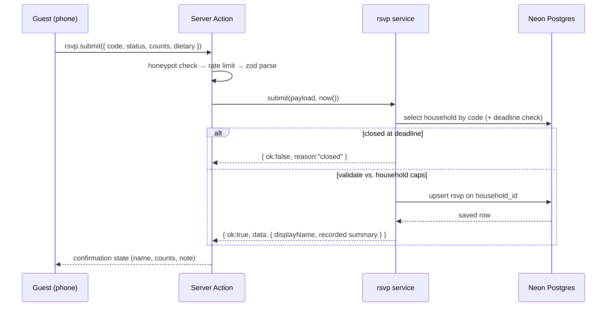
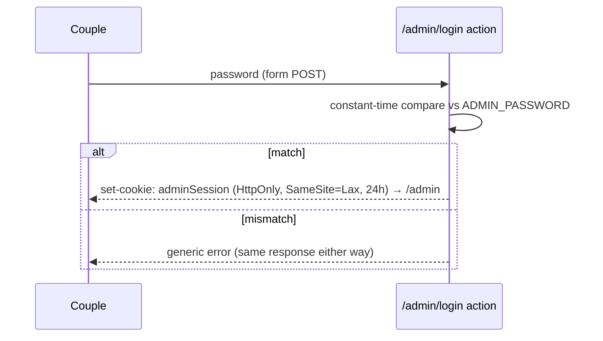

# Architecture Document — rsvp
**Project:** rsvp · **Version:** 0.1 · **Status:** Draft · **Updated:** 2026-09-28

---

## 1. System Architecture (Logical View)

```
┌──────────────────────────────────────────────────┐
│                  CLIENT TIER                     │
│        Next.js App Router, route "/"             │
│  Server-rendered sections + one form island;     │
│  form hydrates progressively (works without JS)  │
└────────────────────┬─────────────────────────────┘
                     │ RSC payload / POST server action / route handlers
┌────────────────────┴─────────────────────────────┐
│                  APP TIER (Vercel)               │
│   Server Components · Server Actions · Handlers  │
│   Middleware: robots → admin session → rate →    │
│   zod validate → route handler                   │
│   "/admin" (separate route + cookie session)     │
└────────────────────┬─────────────────────────────┘
                     │ serverless driver, TLS
┌────────────────────┴─────────────────────────────┐
│                   DATA TIER                      │
│             Neon Postgres (Drizzle)              │
└──────────────────────────────────────────────────┘
```

There is no separate API server: server actions carry form submissions;
two small route handlers exist only where media semantics differ
(type-ahead `/api/lookup`, download `/admin/export.csv`).

---

## 2. Container Diagram



No SMTP, no scheduler, no third-party services beyond hosting + database.

---

## 3. Design Methodology

### 3.1 API Style
Server Actions for mutations (`rsvp.submit`, `rsvp.lookup` progressive-fallback
path) — typed request/response, no URLs to version. Two REST-ish route
handlers for the two places that genuinely need HTTP semantics:

| Path | Verb | Purpose |
|---|---|---|
| `/api/lookup?q=<query>` | GET | Type-ahead search, returns masked matches + codes, rate-limited |
| `/admin/export.csv` | GET | CSV download with `Content-Disposition` (needs HTTP headers) |

Statuses: `200` on success, `429` on rate limit, `401` where admin session
missing. No versioning — internal single-purpose handlers, changing them is a
deploy that also changes the only consumer.

### 3.2 Layered Architecture (within the app)

```
route/page component → action/handler (validate + orchestrate)
                     → service module (domain rules, pure where possible)
                     → data access (Drizzle) → Postgres
```

| Layer | Responsibility | Dependencies |
|---|---|---|
| Page/component | Render, collect input (thin) | server-only data fns |
| Action/handler | Auth gate, zod parse, rate limit, status codes | services |
| Service | Domain rules: cap clamp, upsert semantics, masking, deadline logic | data access, injected time source |
| Data access | Drizzle queries only, no business logic | Drizzle |

### 3.3 Frontend Paradigm
Server Components render everything except the form island and the animated
confirmation state. Client state limited to: type-ahead query results,
current form values, submit status (`idle/submitting/success/error`).
No router state — one page + section anchors (`#rsvp`, `#info`, `#story`,
`#schedule`, `#dresscode`).

### 3.4 Pragmatic MVP Approach
- Single app, single deploy; `server-only` modules for anything touching DB/env.
- Duplication between client form types and server zod schemas is allowed
  once (client derives types *from* zod schemas via `z.infer`, so there is
  exactly one validator).
- One command local dev: `pnpm dev` (Next dev + Neon branch DB from `.env`).

---

## 4. Design Patterns

### 4.1 Middleware Chain
Next.js `middleware.ts` (Edge) handles only what is global and cheap:
```
requestLogger (setattr request-id) → securityHeaders (CSP, X-Frame-Options)
→ robots rules for /admin → matcher limits scope to relevant paths
```
Auth check, rate limiting, and validation live in the action/handler layer
(deeper checks belong near the data, not in edge middleware).
Registration order matters: logging first (every request observable), security
headers before anything renders, robots before routes are reached.

### 4.2 Validation Boundary
zod schemas in `lib/validation.ts` are the single definition of every payload
and DB write. Server actions parse immediately; the client form uses the
*same* schemas (via a client-safe export) so browser-side hints and server
rejection cannot drift.

### 4.3 Error Handling Pattern
```ts
type ActionResult<T> = { ok: true; data: T } | { ok: false; reason: ActionErrorReason; message: string }
```
Server actions return discriminated results, they never throw across the
network boundary and never expose internals (`reason` is a closed union:
`not_found · closed · validation_failed · rate_limited · unavailable`).
Unexpected failures log through `pino` with request-id, return
`{ ok: false, reason: "unavailable" }`, and the UI renders the retry copy.

### 4.4 Idempotent Background Job
Nothing is scheduled in v1 — the deadline is derived at request time (§9.2),
so a missed cron can never silently wedge business state. If a background job
is ever added (e.g. post-wedding dietary-note purge), it MUST be idempotent by
construction: a ledger table keyed by `job_idempotency_key` records each run,
and the job's side effects are deterministic re-runs (delete/update where
condition, no "fire once" latest).

---

## 5. Data Flow (RSVP submission)



Type-ahead flow is the same shape with GET `/api/lookup` → masked matches.

---

## 6. Entity-Relationship Diagram
See `SCHEMA.md` §2 (single source); no condensed copy kept.

---

## 7. Deployment Topology

### 7.1 Development (Local)
```yaml
services:
  web: { command: pnpm dev, ports: ["3000:3000"] }
  db:  { Neon branch via connection string in .env }
```
`pnpm dev` starts Next; the DB is a throwaway Neon branch; `pnpm seed` fills it.
No Docker beyond this — the stack is serverless-native.

### 7.2 Production

| Component | Host | Notes |
|---|---|---|
| Next.js app (RSC + actions) | Vercel free tier | preview deploy per PR; prod on push to main |
| Postgres | Neon free tier (Singapore) | closest region to guests (Naga City, PH); pooled serverless driver |
| Function region | Vercel `sin1` | colocated with Neon for lowest action latency |
| Custom domain | skipped | free `*.vercel.app` in v1 |

**Environment variables (production):**
```
DATABASE_URL=...
SESSION_SECRET=...        # signs the admin cookie
ADMIN_PASSWORD=...        # ≥ 12 chars
RSVP_DEADLINE_DATE=...    # e.g. 2027-06-01, Asia/Manila (open item: couple to set)
```

---

## 8. Sequence Diagrams

### 8.1 Admin Login Flow

No refresh tokens, no "remember me" — 24h sessions fit the couple's usage.

### 8.2 RSVP Lifecycle
Create = first successful submit (upsert insert) → Update = later submit
overwrites (`updatedAt` bumped, old values replaced) → automated follow-up:
none (see §4.4).

---

## 9. Key Implementations

### 9.1 Authentication
Admin-only; cookie session signed with `SESSION_SECRET` (HMAC), HttpOnly,
SameSite=Lax, 24h expiry, constant-time password compare. /admin pages and
`/admin/export.csv` both call the same `requireAdminSession()` guard.

### 9.2 Derived State (computed, not stored)
- `isClosed` — computed at request time from `now()` vs. `RSVP_DEADLINE_DATE`
  (timezone `Asia/Manila`), never persisted, injected as a `timeProvider`
  so tests are deterministic.
- Accepted headcount totals / pending lists — computed in the admin query.
- Nothing about response state is cached longer than one request.

### 9.3 Scheduled Job
None (see §4.4) — deadline is derived, not enforced by cron.

### 9.4 Dashboard Freshness
The admin dashboard re-renders live without dedicated push infra: a
visibility-aware 15s polling loop (`router.refresh()`, only when the tab is
visible) plus a manual "Refresh now" button. At wedding-scale traffic a
database round trip every 15s per open admin tab is cheap; SSE/websockets
would add infra for no observed need — revisit only if the couple ever wants
a sub-second push alert.

---

## 10. Security Boundaries

| Layer | Control | Implementation |
|---|---|---|
| Transport | HTTPS only | Vercel edge, HSTS default |
| Credentials | One shared admin password | env var, constant-time compare |
| Sessions | Signed cookie, HttpOnly, 24h | `SESSION_SECRET` + `jose` HMAC |
| Guest enumeration | Masked lookups + rate limit + honeypot | `429` responses, silent discard on honeypot |
| Admin routes | Session guard + `noindex` + robots disallow | `/admin/*`, `/admin/export.csv` |
| Secrets | Environment variables only | never committed; `.env.example` documents shape |
| Validation | zod at boundary | every action/handler, no exceptions |
| Headers | CSP (self + fonts/images allowlist), X-Frame-Options DENY | edge middleware |
| Deletion | Not automated | documented truncate post-wedding |

---

## 11. Error Handling & Observability

### 11.1 Central Error Handler
Server actions return `ActionResult` (§4.3); the `/api/*` handlers wrap the
same service calls and map `reason` → status code in one place
(`mapErrorToResponse`), so status meaning is defined exactly once.

### 11.2 Structured Logging
`pino` JSON logs on Vercel; every request logs `{ requestId, route, outcome,
durationMs }`; dietary notes, names, admin password attempts' values are
redacted/omitted — log the event, never the payload.

### 11.3 Observability Summary

| Tool | Purpose | Where |
|---|---|---|
| pino (platform logs) | Structured request/action logs | all server-side |
| Vercel build + runtime monitors | Deploy + runtime health | CI/dev loop |
| Lighthouse (CI script) | Mobile perf/a11y gate | pre-merge on PR |
| `npx impeccable detect` | Design anti-pattern gate | pre-merge on `src/` |

### 11.4 Health Endpoint
`/api/health` → `{ ok, db: reachable, uptimeSeconds }` (DB via a trivial
`select 1`), used by a manual post-deploy smoke step (§ M5 in PRD).

---

## 12. Cross-Cutting Concerns (Middleware Ordering)

Concrete registration order and why:
1. **Request logger** first — every incoming request observable even if later
   stages fail; assigns request-id that error handlers and logs share.
2. **Security headers** next — before any route can render (CSP, no-sniff,
   frame-deny); cheap and uniform.
3. **Robots rules** before route matching — `/admin` must be non-indexable
   even in old caches.
4. **Everything else is *not* middleware** by design: auth (session guard),
   rate limiting, and zod live in actions/handlers where the context
   (route, body) is known — edge middleware would only guess.
5. **Error/response mapping last** (in handler code), so successes and
   failures flow through the same `mapErrorToResponse`.

---

## 13. Project Directory Structure

```
rsvp/
├── app/                       # Next.js App Router
│   ├── page.tsx               # the guest page (all sections)
│   ├── admin/                 # login + dashboard (session-gated)
│   ├── api/lookup/route.ts    # type-ahead handler
│   ├── api/health/route.ts    # smoke endpoint
│   ├── actions/rsvp.ts        # server actions (submit/lookup fallback)
│   └── globals.css            # Tailwind v4 tokens (per DESIGN.md)
├── components/                # sections + form island (PascalCase files)
├── lib/                       # services, validation, deadline, csv, letters
│   ├── validation.ts          # zod — single source
│   └── deadline.ts            # pure EU/Berlin deadline helpers
├── db/                        # drizzle schema, client, migrations
├── scripts/seed.ts            # idempotent guest-list loader
├── data/guest-list.csv        # the couple's list (from their reply)
├── assets/hero/               # 1-3 engagement photos (from the couple)
├── context/                   # this documentation
└── docker-compose.yml         # optional local parity (§7.1)
```

---

## 14. Technology Choices & Rationale

| Choice | Rationale |
|---|---|
| Next.js server actions over a REST API | one app, types shared with forms, plain `<form>` fallback for no-JS phones |
| Neon over Supabase | same Postgres, simpler auth-free model (no row-level-security layer to configure for a 2-table schema) |
| Drizzle over Prisma | lighter serverless payload, plain SQL-ish migrations fit the 2-table scope |
| `motion` over GSAP | our motion budget is small, transform/opacity-only; no scroll-scrub timelines to justify GSAP's weight on old phones |
| Tailwind v4 tokens | design tokens live in CSS variables (per `DESIGN.md`), audit-friendly with `impeccable detect` |
| pino over console | structured logs without PII risk, zero server cost on Vercel |

---

## 15. Scalability Notes (later phases)
For a wedding this is intentionally not a scale system; if it ever grew:
1. Swap in-memory rate limiting for Upstash Redis if any single IP limit ever
   matters in practice.
2. Move type-ahead to pg_trgm fuzzy matching if guest counts exceed the
   simple `ILIKE` plan comfortably (≈ thousands).
3. Add a tiny admin write path (household edits) if seed CSV maintenance
   becomes annoying — deferred on purpose in v1.
